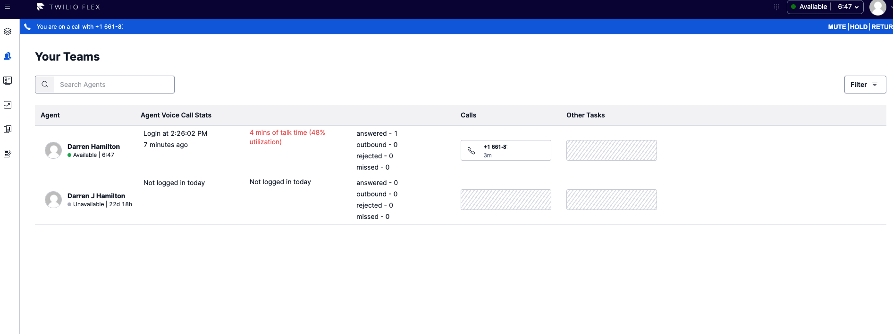

# Customize the Teams View for Flex 2.0 to show daily stats per agent

## Disclaimer

**This software is to be considered "sample code", a Type B Deliverable, and is delivered "as-is" to the user. Twilio bears no responsibility to support the use or implementation of this software. This plugin has not been tested at scale (with multiple workers). Check your browsers performance at scale and [Sync Limits](https://www.twilio.com/docs/sync/limits) to ensure this plugin fits your needs.**

## Pre-Requisites

**This plugin makes use of Paste which is a dependency on Flex 2.0**

## Solution Overview

This plugin demonstrates

- Adding a column to the Flex UI Teams View by adding component to [WorkersDataTable](https://assets.flex.twilio.com/docs/releases/flex-ui/2.0.0-beta.1/programmable-components/components/WorkersDataTable)
- [Twilio Sync](https://www.twilio.com/docs/sync/api)
- [Paste](https://paste.twilio.design/).

The AgentStatsCard component subscribes to a Sync Document for each worker and displays daily stats.

The TaskRouter event stream webhook is sent to a Twilio Function and updates the workers Sync Document based on worker activity and reservation events. This POC could be easily refactored to make use to use [Twilio Event Steam](https://www.twilio.com/docs/events/event-types#taskrouter)

In this POC a login counts as an agent moving into an available activity for the first time that day. This login time is stored and stats are reset.

The plugin only counts Voice call reservations but could be modified to handle chat/messages.

## Screenshot



## Setup

### Pre-Requsites for Setup

- An active Twilio account with Flex provisioned. Refer to the [Flex Quickstart](https://www.twilio.com/docs/flex/quickstart/flex-basics#sign-up-for-or-sign-in-to-twilio-and-create-a-new-flex-project") to create one.
- npm version 5.0.0 or later installed (type `npm -v` in your terminal to check)
- Node.js version 12 or later installed (type `node -v` in your terminal to check)
- [Twilio CLI](https://www.twilio.com/docs/twilio-cli/quickstart#install-twilio-cli) along with the [Flex CLI Plugin](https://www.twilio.com/docs/twilio-cli/plugins#available-plugins) and the [Serverless Plugin](https://www.twilio.com/docs/twilio-cli/plugins#available-plugins). Run the following commands to install them:

  ```bash
  # Install the Twilio CLI
  npm install twilio-cli -g
  # Install the Serverless and Flex as Plugins
  twilio plugins:install @twilio-labs/plugin-serverless
  twilio plugins:install @twilio-labs/plugin-flex
  ```

### Serverless

Add a .env file and set TWILIO_SYNC_SERVICE_SID to be the ISxx Sid for the default Sync Service for the account.

Deploy the TaskRouter event handler function

```
cd serverless/serverless-forAgentStatsCard
twilio serverless:deploy
```

and note the domain that is created and update the TaskRouter event stream to point to the domain that it is deployed to.
https://serverless-foragentstatscard-xxxx-dev.twil.io/taskrouter-event-handler

### Run Plugin Locally

```
# Install Dependencies
npm install

# Start Flex Plugins
twilio flex:plugins:start
```

### Deploy Plugin

After testing the plugin locally you can deploy the plugin to your account using the [Flex Plugins CLI](https://www.twilio.com/docs/flex/developer/plugins/cli/deploy-and-release)
